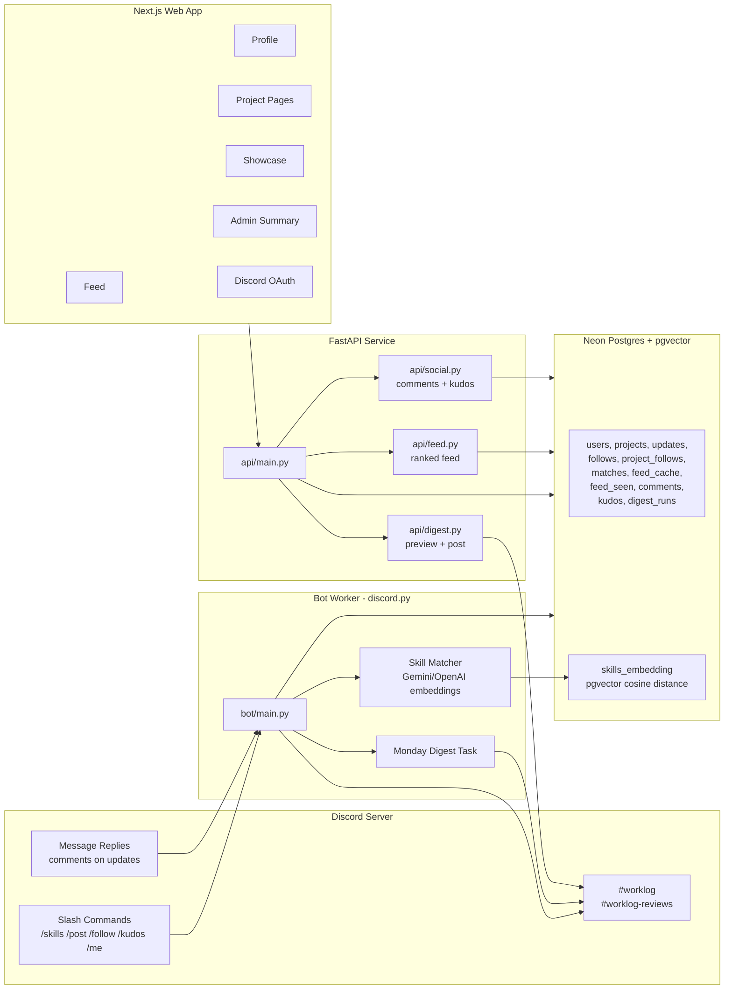

# Worklog

Discord-native work updates, blocker routing, ranked feeds, social feedback, and cohort digests for project-building communities.

Worklog keeps the cohort's writing flow inside Discord, but turns posts into structured data that can be ranked, searched, summarized, followed, and surfaced on the web. It was designed for project-building cohorts where shipped work, blockers, review requests, and project continuity often get buried in chat.

## Highlights

- **Discord-first workflow**: members post with slash commands instead of leaving Discord.
- **Structured updates**: shipped work, progress, blockers, and review requests are stored as first-class records.
- **Skill-matched blocker routing**: blocker posts are embedded and matched against member skill profiles with Gemini or OpenAI embeddings.
- **Ranked web feed**: logged-in users get a personalized feed based on recency, follows, update type, skill match, and seen state.
- **Social feedback**: comments and kudos work from both Discord and the web.
- **Project follows and showcase**: projects can be followed and displayed on a public showcase page.
- **Weekly digest**: preview or post a Discord weekly digest, with automatic Monday scheduling in the bot.
- **Deploy-ready**: Render config for API + bot and Vercel-ready Next.js web app.

## Architecture



## Core Flows

1. A member runs `/skills python, postgres, fastapi`.
2. Another member runs `/post blocked Stuck on pgvector similarity search`.
3. Worklog stores the update, embeds the blocker, finds skill-matched helpers, and DMs likely helpers.
4. The update appears in Discord and the ranked web feed.
5. Members can give kudos, comment by replying in Discord, or comment from the web.
6. Weekly digest summarizes recent cohort activity and posts back to Discord.

## Features

### Discord Bot

- `/skills <skills>` stores a member skill profile and embedding.
- `/post shipped <message>` posts shipped work to `#worklog`.
- `/post progress <message>` posts progress updates.
- `/post blocked <message>` posts blockers and routes them to matched helpers.
- `/post review <link>` posts review requests to `#worklog-reviews`.
- `/follow user @member` follows a member.
- `/follow project project_id:<id>` follows a project.
- `/kudos update_id:<id>` toggles kudos on an update.
- `/me` DMs the caller a summary of recent activity.
- Replies to Worklog embeds are stored as comments.
- Monday digest task posts once per week and records `digest_runs`.

### API

- Health: `GET /health`
- Updates: `GET /updates`, `GET /updates/{id}`
- Ranked feed: `GET /feed`, `POST /feed/seen`
- Social: `GET /social`, `GET /updates/{id}/social`
- Comments: `POST /updates/{id}/comments`
- Kudos: `POST /updates/{id}/kudos`
- Projects: `GET /projects/{id}`, `GET /projects/{id}/updates`
- Project follows: `GET /projects/{id}/social`, `POST /projects/{id}/follow`
- Showcase: `GET /showcase`
- Admin: `GET /admin/summary`
- Digest: `GET /digest/preview`, `POST /digest/trigger`

### Web App

- Public chronological feed
- Logged-in ranked feed
- Discord OAuth login/logout
- Profile page
- Project detail pages with follow button
- Update thread pages
- Kudos and comments UI
- Public showcase page
- Lightweight admin summary page

## Tech Stack

- **Python 3.11+**
- **discord.py** for the bot worker
- **FastAPI** for the API service
- **SQLAlchemy + Alembic** for persistence and migrations
- **Neon Postgres + pgvector** for relational data and vector search
- **Gemini or OpenAI embeddings** for skill matching
- **Next.js App Router** for the web app
- **Render** for API + bot deployment
- **Vercel** for web deployment

## Repository Structure

```text
api/                 FastAPI routes and service modules
bot/                 Discord bot commands, matcher, social handlers
docs/                Setup, phase, and deployment docs
migrations/          Alembic migrations
scripts/             Doctor and E2E utility scripts
shared/              Config, database session, models, schemas, embeddings
web/                 Next.js web app
render.yaml          Render API + worker blueprint
```

## Data Model

Main tables:

- `users`: Discord identity, display name, skill text, skill embedding
- `projects`: project records and owner relationship
- `updates`: shipped/progress/blocked/review updates
- `follows`: user-to-user follows
- `project_follows`: user-to-project follows
- `matches`: blocker routing matches and helper responses
- `feed_cache`: per-viewer ranked feed cache
- `feed_seen`: down-ranks already viewed updates
- `comments`: comments from Discord replies or web
- `kudos`: one kudo per user per update
- `digest_runs`: weekly digest dedupe tracking

## Local Setup

### 1. Prerequisites

- Python 3.11+
- Node.js 20+
- Discord application + bot
- Discord test server
- Neon Postgres database
- Gemini API key or OpenAI API key

### 2. Environment

```bash
cp .env.example .env
cp web/.env.example web/.env.local
```

Fill in the values described in [Environment Variables](#environment-variables).

### 3. Python Dependencies

```bash
python3 -m venv .venv
source .venv/bin/activate
pip install -e ".[dev]"
```

### 4. Database

```bash
alembic upgrade head
```

### 5. Web Dependencies

```bash
npm --prefix web install
```

## Running Locally

Run each service in a separate terminal:

```bash
# API
source .venv/bin/activate
uvicorn api.main:app --reload
```

```bash
# Discord bot
source .venv/bin/activate
python -m bot.main
```

```bash
# Web
npm --prefix web run dev
```

Open:

```text
http://localhost:3000
```

## Environment Variables

### API and Bot

- `DATABASE_URL`: Neon Postgres URL. `postgresql://...` and `postgresql+asyncpg://...` are supported.
- `DISCORD_TOKEN`: Discord bot token.
- `DISCORD_GUILD_ID`: Optional guild ID for faster slash-command sync in development.
- `WORKLOG_CHANNEL_ID`: Channel where shipped/progress/blocked updates are posted.
- `REVIEW_CHANNEL_ID`: Channel where review requests are posted.
- `EMBEDDING_PROVIDER`: `gemini` or `openai`.
- `EMBEDDING_DIMENSIONS`: Defaults to `1536`, matching the `pgvector` column.
- `GEMINI_API_KEY`: Required when `EMBEDDING_PROVIDER=gemini`.
- `GEMINI_EMBEDDING_MODEL`: Defaults to `gemini-embedding-001`.
- `OPENAI_API_KEY`: Required when `EMBEDDING_PROVIDER=openai`.
- `OPENAI_EMBEDDING_MODEL`: Defaults to `text-embedding-3-small`.
- `DIGEST_TRIGGER_TOKEN`: Bearer token for digest/admin endpoints.
- `DIGEST_CHANNEL_ID`: Optional digest channel. Defaults to `WORKLOG_CHANNEL_ID`.
- `DIGEST_POST_HOUR_UTC`: Monday digest hour in UTC. Defaults to `14`.
- `PUBLIC_BASE_URL`: API base URL for local or production use.

### Web

- `WORKLOG_API_URL`: FastAPI URL used by the Next.js server.
- `WEB_AUTH_SECRET`: Long random secret for signing session cookies.
- `DISCORD_CLIENT_ID`: Discord OAuth client ID.
- `DISCORD_CLIENT_SECRET`: Discord OAuth client secret.
- `DISCORD_REDIRECT_URI`: Discord OAuth callback URL.
- `DIGEST_TRIGGER_TOKEN`: Optional. Enables the server-rendered `/admin` page.

## Testing

### Doctor Check

```bash
source .venv/bin/activate
python scripts/doctor.py
```

### API E2E Check

```bash
source .venv/bin/activate
python scripts/e2e_api.py
```

### Web Typecheck

```bash
npm --prefix web run typecheck
```

### Manual Discord E2E

1. Run `/skills python, fastapi, postgres`.
2. Run `/post progress Testing Worklog`.
3. Run `/post blocked Stuck on pgvector search`.
4. Confirm skill-matched helpers receive DMs.
5. Reply to a Worklog embed and confirm it appears as a web comment.
6. Use `/kudos update_id:<id>`.
7. Use `/follow project project_id:<id>` once project rows exist.
8. Trigger digest preview or post with the protected digest endpoint.

## Deployment

Production deployment uses:

- **Render** for the FastAPI service and Discord bot worker
- **Vercel** for the Next.js app
- **Neon** for Postgres

See [docs/deploy.md](docs/deploy.md) for step-by-step deploy instructions.

## Documentation

- [Phase 1 E2E Setup](docs/phase1-e2e.md)
- [Phase 2 Web Viewer](docs/phase2-web.md)
- [Phase 3 Ranked Feed](docs/phase3-feed.md)
- [Phase 4 Social Feedback](docs/phase4-social.md)
- [Phase 5 Digest, Follows, Showcase, Deploy](docs/phase5-polish.md)
- [Production Deploy](docs/deploy.md)

## Security Notes

- Never commit `.env` or `web/.env.local`.
- Rotate secrets if they are pasted into chat, logs, screenshots, or shared docs.
- Keep Discord OAuth redirect URLs exact; `localhost` and `127.0.0.1` are different to Discord.
- Enable Discord **Message Content Intent** for reply-to-comment support.
- Use `DIGEST_TRIGGER_TOKEN` for protected digest and admin endpoints.

## Roadmap

- Production deployment on Render + Vercel
- Project creation/editing from Discord or web
- Richer project status timelines
- AI-generated weekly or project summaries
- Moderation/admin controls
- CI workflow for lint/typecheck/E2E smoke tests

## Status

Implemented locally:

- Phase 1: Discord bot MVP
- Phase 2: Web viewer and OAuth
- Phase 3: Ranked feed
- Phase 4: Comments and kudos
- Phase 5: Digest, project follows, showcase, admin summary, deploy docs

The remaining major step is production deployment and live cohort testing.
